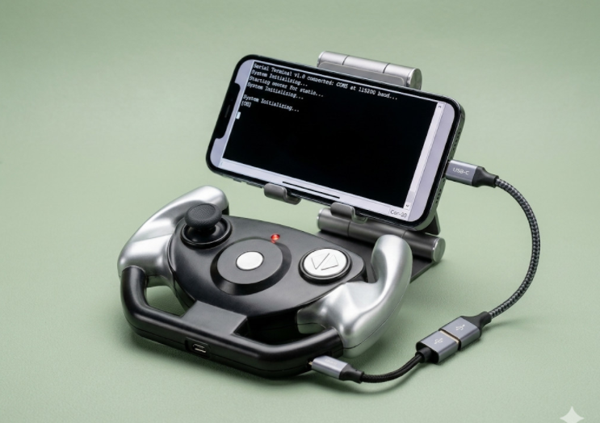
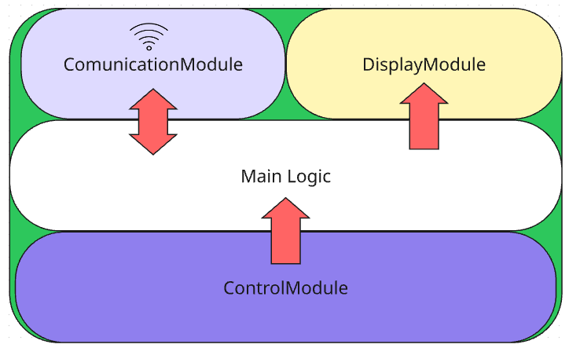
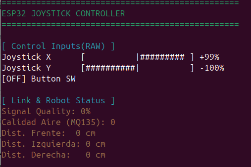

# Controller32 🕹️

**Controller32** es un firmware modular para ESP32 desarrollado sobre **ESP-IDF (v5.3)**. El proyecto implementa un sistema de control tipo joystick guiado por eventos, desacoplando completamente el hardware físico de la lógica de negocio y los canales de comunicación mediante interfaces polimórficas (contratos en C).

## 📌 Arquitectura Conceptual y Módulos

El sistema está diseñado bajo una arquitectura limpia y modular. Cada periférico o protocolo expone una interfaz abstracta, permitiendo intercambiar el hardware subyacente (por ejemplo, cambiar el motor gráfico serial por una pantalla física OLED, o ESP-NOW por Bluetooth) sin alterar el flujo principal en `main.c`.



### Componentes Principales:
1. **Control de Entrada (Joystick/Botones):** Monitorea de forma eficiente (0% CPU mediante interrupciones y tareas bloqueantes) los ejes analógicos y pulsadores del periférico.
2. **Interfaz de Usuario (Display Serial):** Un motor gráfico agnóstico que renderiza barras de progreso bipolares, indicadores de estado y alertas críticas utilizando secuencias de escape ANSI directo sobre la consola Serial.
3. **Módulo de Comunicación (ESP-NOW):** Canal de baja latencia encargado de la transmisión inalámbrica asincrónica y el cálculo de la calidad del enlace (RSSI).


---

## 📂 Estructura del Proyecto

El proyecto utiliza el sistema de construcción oficial de ESP-IDF basado en CMake, organizando las abstracciones dentro de la carpeta `components`:

```text
├── CMakeLists.txt          # Configuración global de CMake para el proyecto
├── components              # Componentes modulares reutilizables
│   ├── communication       # Módulo inalámbrico
│   │   ├── CMakeLists.txt
│   │   ├── CommunicationInterface.h  # Contrato genérico (init, send, receive, etc.)
│   │   └── EspNowCommunication.c     # Implementación específica sobre protocolo ESP-NOW
│   ├── controll            # Módulo de periféricos de entrada
│   │   ├── CMakeLists.txt
│   │   ├── ControllInterface.h       # Contrato guiado por eventos y colas
│   │   └── JoystickInput.c           # Inicialización de ADC1, GPIOs y Handlers ISR
│   └── display             # Módulo de interfaz gráfica
│       ├── CMakeLists.txt
│       ├── DisplayInterface.h        # Contrato de renderizado (refreshUi, updateProgressBar)
│       └── SerialOutput.c            # Renderizador libre de parpadeo (Flicker-free) vía ANSI
└── main                    # Punto de entrada de la aplicación
   ├── CMakeLists.txt
   └── main.c              # Orquestador del sistema, inicialización de Mutex y creación de tareas FreeRTOS

```

---

## 🛠️ Esquema de Conexión (Hardware)

Para interactuar con el controlador, se requiere mapear un joystick analógico convencional (ejes X/Y y pulsador interno Z) junto con dos botones adicionales de acción (A y B) alimentados a **3.3V**.

### Tabla de Pines (ESP32 de 38 pines recomendado)

| Componente | Pin del Periférico | Pin GPIO (ESP32) | Configuración Interna | Notas |
| --- | --- | --- | --- | --- |
| **Joystick Eje X** | VRX / X-Axis | **GPIO 32** (ADC1_CH4) | Oneshot ADC | Crítico usar ADC1 (evita conflicto con Wi-Fi) |
| **Joystick Eje Y** | VRY / Y-Axis | **GPIO 33** (ADC1_CH5) | Oneshot ADC | Crítico usar ADC1 |
| **Pulsador Click** | SW | **GPIO 25** | Entrada con Pull-Up | Interrupción por flanco de bajada (ISR) |
| **Botón A** | Pulsador A | **GPIO 26** | Entrada con Pull-Up | Interrupción por flanco de bajada (ISR) |
| **Botón B** | Pulsador B | **GPIO 27** | Entrada con Pull-Up | Interrupción por flanco de bajada (ISR) |
| **Alimentación** | +5V / VCC | **3.3V** | - | Alimentar desde el riel regulado del ESP32 |
| **Referencia** | GND | **GND** | - | Tierra común |

---

## 🚀 Compilación y Despliegue

Asegúrate de tener el entorno de **ESP-IDF exportado (v5.3)** en tu terminal antes de comenzar.

### 1. Clonar el repositorio

```bash
git clone [https://github.com/TwBenjaminVargas/Controller32.git](https://github.com/TwBenjaminVargas/Controller32.git)
cd Controller32

```

### 2. Configurar el Target (por defecto ESP32)

```bash
idf.py set-target esp32

```

### 3. Compilar, flashear y monitorear el dispositivo

Ejecuta el comando combinado para compilar el código, subirlo a la placa a través del puerto serial y abrir el monitor interactivo ANSI:

```bash
idf.py build flash monitor

```

> 💡 **Nota sobre el Monitor:** La interfaz de usuario redibuja dinámicamente la consola utilizando códigos de escape seriales. Se recomienda no alterar el tamaño de la ventana de la terminal durante su ejecución para evitar desfases en las barras de progreso virtuales.

---

## 📺 Demostración en Funcionamiento

Cuando el sistema inicia, la tarea de UI refresca continuamente la terminal visualizando de forma interactiva el valor bipolar del joystick (mapeado respecto al *Deadzone* configurado para mitigar ruidos de lectura) y el estado lógico de los botones e interrupciones inalámbricas.


